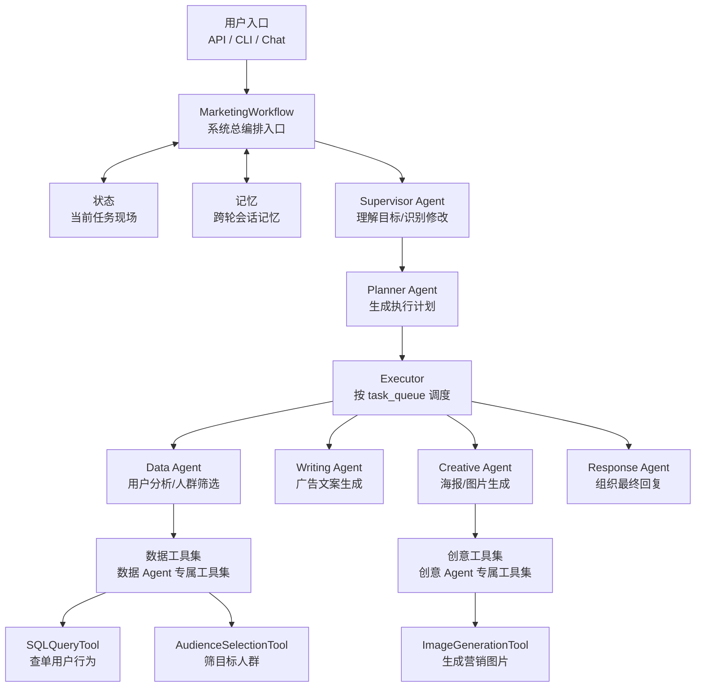

# AI Ecommerce Marketing Multi-Agent System

这是一个面向电商营销场景的多 Agent 协作系统。当前代码已经按 `总控智能体 -> 规划智能体 -> 执行器 -> 专家智能体 -> 专属工具集` 重组完成。

## 项目定位

系统支持三类核心任务：

- 用户行为理解
- 营销人群筛选
- 文案 / 海报 / 图片生成

典型请求：

- `张三最近在看什么，帮我给他写一条广告文案`
- `最近谁在关注羊毛衫，筛出可推送用户`
- `帮我做一张羊毛衫 6 折海报`
- `上海地区最近谁在关注羊毛衫，顺便生成一版文案和海报`

## 当前架构



看图方式：

- `MarketingWorkflow` 是总入口，负责驱动整个系统
- `状态` 和 `记忆` 是所有 Agent 协作的上下文基础
- `Supervisor -> Planner -> Executor` 是上层编排链
- `Data / Writing / Creative / Response` 是领域执行 Agent
- `专属工具集` 表示工具按 Agent 隔离，不是全局共享
- 工具选择与调用基于 LangChain 的 `StructuredTool + bind_tools`

## 目录结构

```text
app/
├─ runtime/
│  ├─ workflow.py
│  └─ state.py
├─ infra/
│  ├─ config.py
│  ├─ database.py
│  └─ llm.py
├─ agents/
│  ├─ supervisor/
│  ├─ planner/
│  ├─ executor/
│  ├─ data/
│  ├─ writing/
│  ├─ creative/
│  └─ response/
├─ tools/
│  ├─ base.py
│  ├─ data/
│  └─ creative/
├─ prompts/
├─ api/
└─ utils/
```

## Agent 边界

### Supervisor Agent
- 负责理解用户目标
- 识别新任务 / 修改 / 确认
- 产出初始任务列表

目录：
- [app/agents/supervisor](/c:/Users/HP/Desktop/智能客服助手demo/app/agents/supervisor)

### Planner Agent
- 负责生成 `execution_plan`
- 负责生成 `query_plan`
- 规范化 `task_queue`

目录：
- [app/agents/planner](/c:/Users/HP/Desktop/智能客服助手demo/app/agents/planner)

### Executor
- 不做业务理解
- 只负责根据 `task_queue` 调度 Agent

目录：
- [app/agents/executor](/c:/Users/HP/Desktop/智能客服助手demo/app/agents/executor)

### Data Agent
- 查询单用户行为
- 筛选目标人群
- 生成轻量洞察

目录：
- [app/agents/data](/c:/Users/HP/Desktop/智能客服助手demo/app/agents/data)

### Writing Agent
- 生成广告文案
- 不直接访问数据库

目录：
- [app/agents/writing](/c:/Users/HP/Desktop/智能客服助手demo/app/agents/writing)

### Creative Agent
- 生成海报提示词
- 触发图片生成工具

目录：
- [app/agents/creative](/c:/Users/HP/Desktop/智能客服助手demo/app/agents/creative)

### Response Agent
- 汇总最终输出
- 面向用户组织回复文本

目录：
- [app/agents/response](/c:/Users/HP/Desktop/智能客服助手demo/app/agents/response)

## Tool 设计

当前是按 Agent 隔离工具，而不是全局开放：

- `Data Agent` 只使用 `数据工具集`
- `Creative Agent` 只使用 `创意工具集`
- `Writing Agent` 当前不直接访问数据库工具

工具调用方式：

- 每个 `toolbelt` 内部把工具封装成 LangChain `StructuredTool`
- Agent 在运行时通过 `LLMClient.choose_tool_call()` 调用 `bind_tools`
- 模型先选工具，再由 Agent 执行工具并记录 `ToolCallRecord`
- 如果模型未返回有效工具，会回退到任务默认工具，保证稳定性

工具目录：
- [app/tools](/c:/Users/HP/Desktop/智能客服助手demo/app/tools)
- [app/tools/data](/c:/Users/HP/Desktop/智能客服助手demo/app/tools/data)
- [app/tools/creative](/c:/Users/HP/Desktop/智能客服助手demo/app/tools/creative)

工具契约定义：
- [app/tools/base.py](/c:/Users/HP/Desktop/智能客服助手demo/app/tools/base.py)

## 状态与记忆

运行时状态定义：
- [app/runtime/state.py](/c:/Users/HP/Desktop/智能客服助手demo/app/runtime/state.py)

核心概念：

- `状态`：当前任务现场
- `记忆`：跨轮会话上下文
- `ToolCallRecord`：工具调用轨迹

## 启动方式

### CLI

```bash
python main.py chat --message "帮我写一条羊毛衫 6 折广告文案" --pretty
python main.py chat --message "看看谁在关注羊毛衫" --json
python main.py serve
```

### API

- `GET /health`
- `POST /api/chat`
- `GET /api/sessions/{session_id}`

## 推荐阅读顺序

1. [app/runtime/workflow.py](/c:/Users/HP/Desktop/智能客服助手demo/app/runtime/workflow.py)
2. [app/runtime/state.py](/c:/Users/HP/Desktop/智能客服助手demo/app/runtime/state.py)
3. [app/agents/supervisor/agent.py](/c:/Users/HP/Desktop/智能客服助手demo/app/agents/supervisor/agent.py)
4. [app/agents/planner/agent.py](/c:/Users/HP/Desktop/智能客服助手demo/app/agents/planner/agent.py)
5. [app/agents/executor/agent.py](/c:/Users/HP/Desktop/智能客服助手demo/app/agents/executor/agent.py)
6. [app/tools](/c:/Users/HP/Desktop/智能客服助手demo/app/tools)

## 架构图与讲解

- 架构文档： [docs/ARCHITECTURE.md](/c:/Users/HP/Desktop/智能客服助手demo/docs/ARCHITECTURE.md)

## 前端交互页面展示

