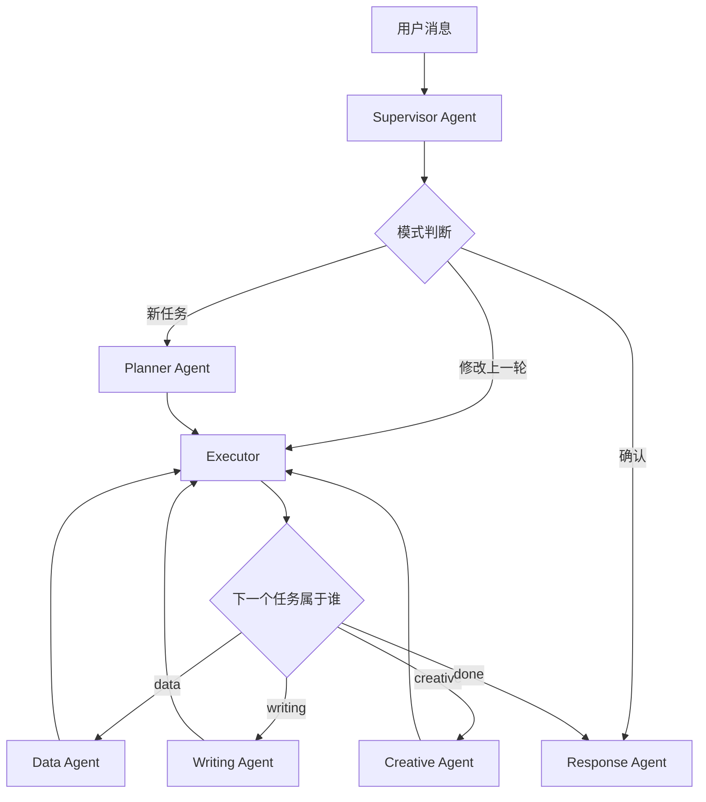
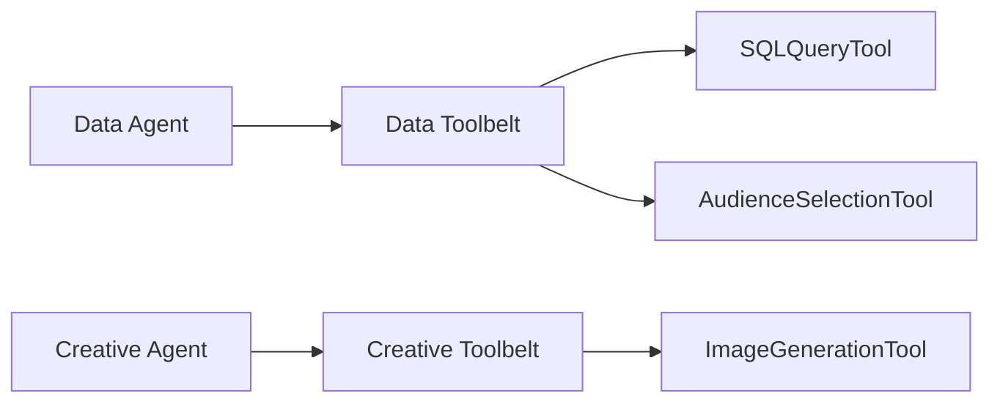
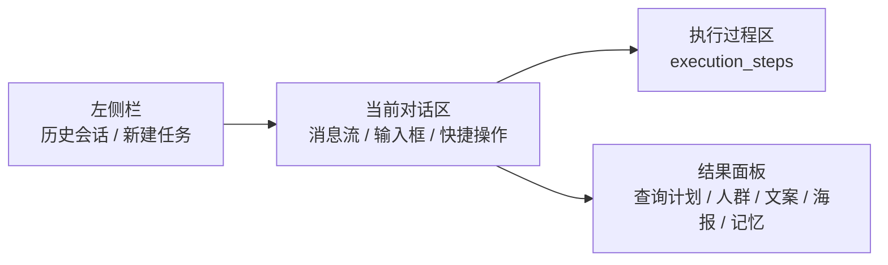

# 架构补充说明

README 已经承载主文档，这份文件只保留更聚焦的架构视角，适合技术讨论或对外讲解时展开使用。

## 建议阅读顺序

1. 先看根目录 `README.md`
2. 再看这份文档理解编排链和执行链
3. 最后对照代码目录进入具体模块

## 编排链

说明：

- `Supervisor Agent` 负责入口理解，不做业务执行
- `Planner Agent` 只在需要规划时出场
- `Executor` 是循环调度器
- `Response Agent` 是统一收口点

## Tool 调用边界

说明：

- 工具不是所有 Agent 共享
- 每个 Agent 只看到自己的工具集合
- 工具选择通过 LangChain `StructuredTool + bind_tools`

## 前端工作台视图

说明：

- 左侧只放历史会话，不混放当前对话
- 中间聚焦当前任务和消息流
- 右侧承接结构化结果，不展示原始 JSON

## 代码定位

- 工作流入口：`app/runtime/workflow.py`
- 状态定义：`app/runtime/state.py`
- 总控理解：`app/agents/supervisor/`
- 规划层：`app/agents/planner/`
- 调度层：`app/agents/executor/`
- 领域 Agent：`app/agents/data/` `app/agents/writing/` `app/agents/creative/` `app/agents/response/`
- 工具层：`app/tools/`
- 前端工作台：`Visual page/`
