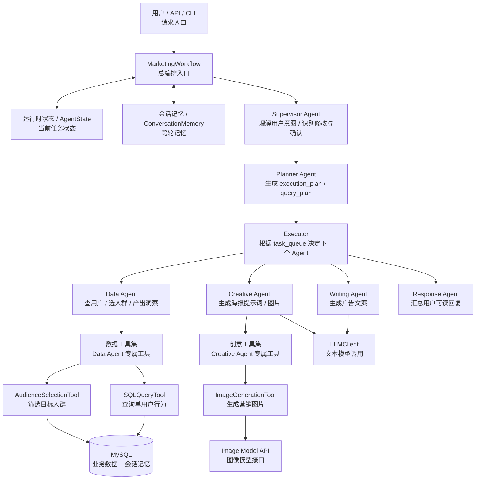
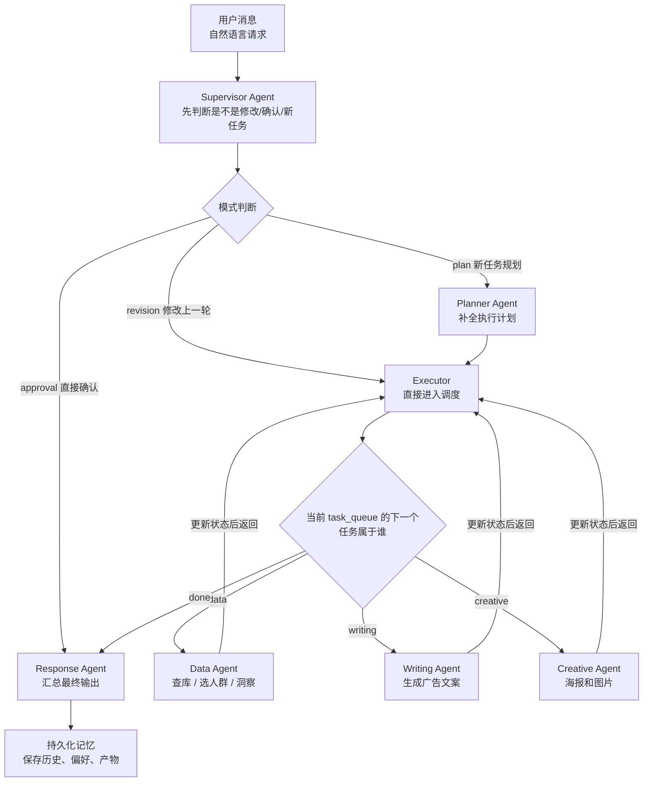

# 架构说明

这份文档直接对应当前代码目录，适合对外讲项目，也适合团队内部理解代码边界。

## 1. 一句话定义

这是一个面向电商营销场景的多 Agent 协作系统：

- `Supervisor Agent` 负责理解用户目标
- `Planner Agent` 负责任务拆解
- `Executor` 负责调度
- `Data / Writing / Creative / Response Agent` 负责领域执行
- Agent 通过共享 `状态` 和 `记忆` 协作
- 每个 Agent 只使用自己的 `专属工具集`
- 工具选择与调用走 LangChain `StructuredTool + bind_tools`

## 2. 总体架构图

这张图的阅读顺序：

- 第一层：`User -> MarketingWorkflow`，说明所有请求都先进入总编排器
- 第二层：`状态 / 记忆`，说明系统不是无状态脚本，而是围绕共享上下文协作
- 第三层：`Supervisor -> Planner -> Executor`，说明这是上层决策链
- 第四层：`Data / Writing / Creative / Response`，说明这是领域执行层
- 第五层：`专属工具集 -> 工具 -> 基础设施`，说明工具被 Agent 隔离，最终落到数据库和模型能力上

## 3. 执行流程图

这张流程图的重点：

- `Supervisor Agent` 负责入口理解，不直接做业务执行
- `Planner Agent` 只在“新任务规划”时出场
- `Executor` 是循环调度器，会不断查看 `task_queue`
- `Data / Writing / Creative Agent` 执行完后都会回到 `Executor`
- `Response Agent` 是统一收口点
- 最后统一写回 `记忆`，保证后续支持追问和修改

## 4. 目录和模块映射

### 4.1 runtime

目录：
- [app/runtime](/c:/Users/HP/Desktop/智能客服助手demo/app/runtime)

职责：
- 编排工作流
- 定义运行时状态
- 汇总最终响应

核心文件：
- [workflow.py](/c:/Users/HP/Desktop/智能客服助手demo/app/runtime/workflow.py)
- [state.py](/c:/Users/HP/Desktop/智能客服助手demo/app/runtime/state.py)

### 4.2 infra

目录：
- [app/infra](/c:/Users/HP/Desktop/智能客服助手demo/app/infra)

职责：
- 配置加载
- 数据库访问
- 模型调用

核心文件：
- [config.py](/c:/Users/HP/Desktop/智能客服助手demo/app/infra/config.py)
- [database.py](/c:/Users/HP/Desktop/智能客服助手demo/app/infra/database.py)
- [llm.py](/c:/Users/HP/Desktop/智能客服助手demo/app/infra/llm.py)

### 4.3 agents

目录：
- [app/agents](/c:/Users/HP/Desktop/智能客服助手demo/app/agents)

每个 Agent 一个目录：

- [supervisor](/c:/Users/HP/Desktop/智能客服助手demo/app/agents/supervisor)
- [planner](/c:/Users/HP/Desktop/智能客服助手demo/app/agents/planner)
- [executor](/c:/Users/HP/Desktop/智能客服助手demo/app/agents/executor)
- [data](/c:/Users/HP/Desktop/智能客服助手demo/app/agents/data)
- [writing](/c:/Users/HP/Desktop/智能客服助手demo/app/agents/writing)
- [creative](/c:/Users/HP/Desktop/智能客服助手demo/app/agents/creative)
- [response](/c:/Users/HP/Desktop/智能客服助手demo/app/agents/response)

### 4.4 tools

目录：
- [app/tools](/c:/Users/HP/Desktop/智能客服助手demo/app/tools)

职责：
- 提供工具契约定义
- 按 Agent 提供受限工具集合
- 隔离工具调用权限
- 通过 LangChain `StructuredTool` 暴露给模型

核心文件：
- [base.py](/c:/Users/HP/Desktop/智能客服助手demo/app/tools/base.py)
- [data/toolbelt.py](/c:/Users/HP/Desktop/智能客服助手demo/app/tools/data/toolbelt.py)
- [creative/toolbelt.py](/c:/Users/HP/Desktop/智能客服助手demo/app/tools/creative/toolbelt.py)

## 5. Agent 边界

### Supervisor Agent

文件：
- [app/agents/supervisor/agent.py](/c:/Users/HP/Desktop/智能客服助手demo/app/agents/supervisor/agent.py)

内部协作组件：
- [feedback_parser.py](/c:/Users/HP/Desktop/智能客服助手demo/app/agents/supervisor/feedback_parser.py)
- [message_parser.py](/c:/Users/HP/Desktop/智能客服助手demo/app/agents/supervisor/message_parser.py)
- [router.py](/c:/Users/HP/Desktop/智能客服助手demo/app/agents/supervisor/router.py)

职责：
- 判断是新任务、修改还是确认
- 提取实体
- 输出第一版任务列表

### Planner Agent

文件：
- [app/agents/planner/agent.py](/c:/Users/HP/Desktop/智能客服助手demo/app/agents/planner/agent.py)
- [app/agents/planner/query_planner.py](/c:/Users/HP/Desktop/智能客服助手demo/app/agents/planner/query_planner.py)

职责：
- 生成 `execution_plan`
- 生成 `query_plan`
- 规范化 `task_queue`

### Executor

文件：
- [app/agents/executor/agent.py](/c:/Users/HP/Desktop/智能客服助手demo/app/agents/executor/agent.py)

职责：
- 从 `task_queue` 中取当前任务
- 决定交给哪个 Agent
- 不直接执行业务工具

### Data Agent

文件：
- [app/agents/data/agent.py](/c:/Users/HP/Desktop/智能客服助手demo/app/agents/data/agent.py)

职责：
- 查用户行为
- 选营销人群
- 产出洞察

### Writing Agent

文件：
- [app/agents/writing/agent.py](/c:/Users/HP/Desktop/智能客服助手demo/app/agents/writing/agent.py)

职责：
- 生成广告文案
- 不直接操作数据库

### Creative Agent

文件：
- [app/agents/creative/agent.py](/c:/Users/HP/Desktop/智能客服助手demo/app/agents/creative/agent.py)

职责：
- 生成海报提示词
- 触发图片生成

### Response Agent

文件：
- [app/agents/response/agent.py](/c:/Users/HP/Desktop/智能客服助手demo/app/agents/response/agent.py)

职责：
- 汇总最终对外回复

## 6. Tool 边界

### 数据工具集

文件：
- [app/tools/data/toolbelt.py](/c:/Users/HP/Desktop/智能客服助手demo/app/tools/data/toolbelt.py)

包含工具：
- [sql_query.py](/c:/Users/HP/Desktop/智能客服助手demo/app/tools/data/sql_query.py)
- [audience_selection.py](/c:/Users/HP/Desktop/智能客服助手demo/app/tools/data/audience_selection.py)

### 创意工具集

文件：
- [app/tools/creative/toolbelt.py](/c:/Users/HP/Desktop/智能客服助手demo/app/tools/creative/toolbelt.py)

包含工具：
- [image_generation.py](/c:/Users/HP/Desktop/智能客服助手demo/app/tools/creative/image_generation.py)

### Tool 契约

文件：
- [app/tools/base.py](/c:/Users/HP/Desktop/智能客服助手demo/app/tools/base.py)

定义：
- 工具名
- 归属 Agent
- 使用说明
- 输入输出 schema
- 失败模式

调用方式：
- `Data Agent` 和 `Creative Agent` 不直接硬编码调用底层函数
- Agent 先把自己可见的工具列表交给 `LLMClient.choose_tool_call()`
- `LLMClient` 内部使用 `ChatOpenAI.bind_tools(...)`
- 模型返回工具名和参数后，再由 `toolbelt.invoke_tool()` 真正执行
- 如果模型没有返回有效工具，系统会按任务类型回退到默认工具

## 7. 状态与记忆

文件：
- [app/runtime/state.py](/c:/Users/HP/Desktop/智能客服助手demo/app/runtime/state.py)

### 状态

当前任务现场：
- `intent_type`
- `entities`
- `task_queue`
- `execution_plan`
- `query_plan`
- `query_result`
- `insight`
- `target_users`
- `ad_copy`
- `poster_spec`
- `generated_image`
- `tool_calls`
- `trace`
- `error`

### 记忆

跨轮会话上下文：
- 历史消息
- 用户偏好
- 上一轮实体
- 上一轮产物
- 当前待确认产物

## 8. 对外汇报可直接使用的话术

可以直接讲成下面这段：

> 这是一个面向电商营销场景的多 Agent 协作系统。系统由 Supervisor Agent 理解用户目标，Planner Agent 拆解任务，Executor 负责调度，Data / Writing / Creative Agent 各自处理数据、人群、文案和海报任务。所有 Agent 围绕共享状态和会话记忆协作，同时每个 Agent 只拥有自己的专属工具集；在工具层，系统使用 LangChain 的 StructuredTool 和 bind_tools 完成工具选择与调用，从而保证工具边界清晰、扩展路径明确、系统行为可解释。

## 9. 当前项目优势

- Agent 边界清晰
- Tool 权限按 Agent 隔离
- 状态 / 记忆 明确分离
- 文档、目录、代码叙事一致
- 更适合后续扩展更多 Agent 和更多专属工具集
